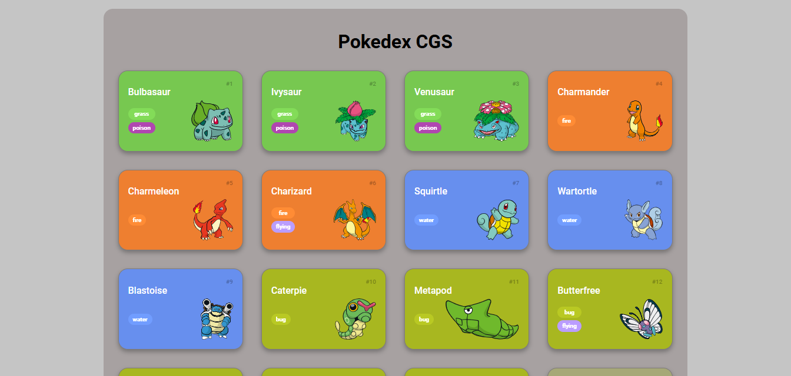
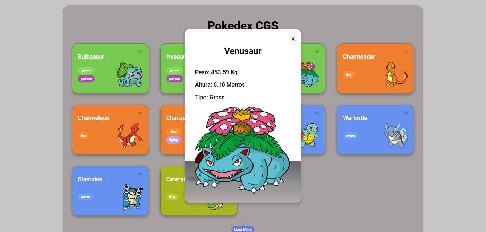
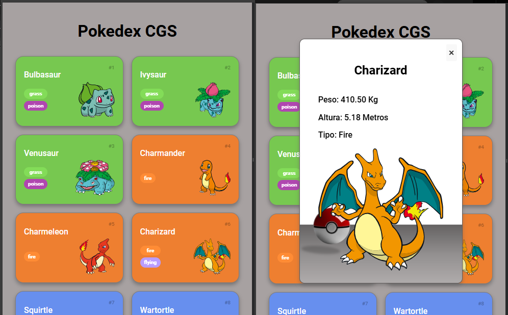

# Trilha JS Developer - Pokedex

# Projeto Pokédex - DIO

Este projeto é uma Pokédex interativa desenvolvida como parte de um desafio da **Digital Innovation One (DIO)**. A aplicação utiliza a [PokeAPI](https://pokeapi.co/) para exibir uma lista de Pokémons e oferece uma interface aprimorada com opções detalhadas para cada Pokémon.

## Funcionalidades

- **Lista de Pokémons**: Exibe uma lista com nome, tipo e imagem de cada Pokémon.
- **Detalhes dos Pokémons**: Ao clicar em um Pokémon, um modal é aberto mostrando informações detalhadas, como peso, altura e tipo.
- **Interface Responsiva**: O layout da Pokédex se ajusta conforme o tamanho da tela, exibindo dois Pokémons por linha em telas menores e mais em telas maiores.
- **Customização de Cores**: As cores de fundo de cada card variam de acordo com o tipo do Pokémon, facilitando a identificação visual.

## Tecnologias Utilizadas

- **HTML5 e CSS3**: Estrutura básica e estilização.
- **JavaScript**: Lógica da aplicação e manipulação de DOM.
- **PokeAPI**: API para obter dados dos Pokémons.

## Alterações Realizadas

As seguintes alterações foram feitas para aprimorar o projeto: https://pokedex-js-dio.vercel.app/

1. **Customização de Cores dos Cards**: Cada card de Pokémon possui uma cor de fundo específica de acordo com o tipo do Pokémon, facilitando a distinção visual entre os tipos.
2. **Modal com Detalhes Adicionais**: Implementado um modal para exibir informações detalhadas dos Pokémons ao clicar em um card, incluindo peso, altura e tipo.
3. **Layout Responsivo**: Ajustado o layout para exibir dois Pokémons por linha em telas menores e expandir em telas maiores.
4. **Correções de Layout**: Configuração de estilo para evitar rolagem lateral da página, garantindo uma experiência de visualização mais limpa.
5. **Posicionamento Fixo do Botão de Fechar**: O botão de fechar do modal foi posicionado de forma fixa no canto superior direito, melhorando a usabilidade.

## Imagens do Projeto

## Contribuições

Contribuições para este projeto são bem-vindas! Se você gostaria de adicionar novas funcionalidades, corrigir bugs ou aprimorar a interface, fique a vontade:

## Link do Projeto (funcionando)

Segue o link do projeto funcionando: https://pokedex-js-dio.vercel.app/

"Vamos Disseminar os Conhecimentos e Transbordar Tudo o que Aprendemos!"
